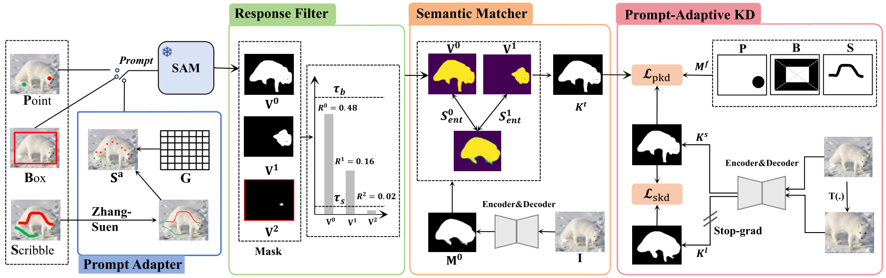
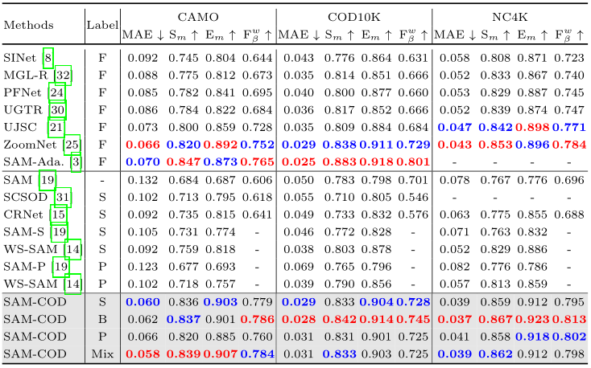

# [ECCV2024] SAM-COD: SAM-guided Unified Framework for Weakly-Supervised Camouflaged Object Detection




# Prerequisites
- python==3.7.5
- torch==1.13.1
- Torchvision==0.14.1
- Scikit_image==0.19.2
- Skimage==0.0
- timm==0.3.2
- tensorboard==2.11.2
- tensorboardX==2.5.1
- tqdm==4.64.1
- einops==0.4.1
- markdown==3.4.3
- markplotlib==3.5.2
- numpy==1.12.6
- opencv-python==4.7.0.72
- openpyxl==3.1.2
- pillow==9.5.0
- pysodmetrics==1.4.0
- PyYAML==6.0
- tabulate==0.9.0

# Download P-COD and B-COD Dataset
- Point supervised dataset P-COD: [google](https://drive.google.com/file/d/17oa6-IU2Dr9Q1KKQ74UoL0hoFd5F7bOd/view?usp=sharing).
- Box supervised dataset B-COD: [google](https://drive.google.com/file/d/1Ds1kBbk1Ifq6awWcIqbQrF79PVwGZW-G/view?usp=sharing).

# Using Segment Anything Model
Following the [SAM](https://github.com/facebookresearch/segment-anything) to create an environment.

Put [SAM's pretrained-model-weight](https://dl.fbaipublicfiles.com/segment_anything/sam_vit_h_4b8939.pth) in './segment-anything-main/sam_vit_h_4b8939.pth'.

Put image in './segment-anything-main/Images'.

- Box-prompt:
  
Put B-COD in './segment-anything-main/B-COD'.

```shell
python predictor_example_box.py  
```

- Point-prompt:
  
Put P-COD in './segment-anything-main/P-COD'.

```shell
python predictor_muti_point.py
```
- Scribble-prompt:

Put the discrete point set generated by sampling the scribble using the adapter to './segment-anything-main/point-set'.

```shell
python predictor_muti_point.py
```
# Prompt Adapter

- Download scribble supervised dataset [S-COD](https://drive.google.com/file/d/1u7PRtZDu2vXCRe0o2SplVYa7ESoZQFR-/view?usp=sharing).

```shell
python prompt-adapter.py
```

# Filter and Matcher

- Train P_Mask

Train the encoder and decoder supervised by [Point_cu](https://drive.google.com/file/d/1L6l5ijona7J5eX5tX8aGSjwCY1oBdV7L/view?usp=drive_link), [scribble](https://drive.google.com/file/d/1u7PRtZDu2vXCRe0o2SplVYa7ESoZQFR-/view?usp=sharing), or Max(SAM(Box_prompt)), where Max(SAM(Box_prompt)) is part of the Segment Anything model.

Put P_mask and segment anything's mask in './xxx'
```shell
python Filter_and_Matcher.py
```

# Distillation encoder and decoder
- Just download the dataset and pretrained model. 


- Train:

The pretrained model weight can be found here: [Pretrain_model](https://drive.google.com/file/d/1169AvHlRnyKdScEHm6yWKSyne3j0N2EZ/view?usp=sharing) . (put it in './SAM-guided-Unified-Framework-for-Weakly-Supervised-Camouflaged-Object-Detection/Pretrain_model.pth').

The masks for distillation are in the path './CodDataset/train/masks'.
  
Put the Prompt-kd-mask in './SAM-guided-Unified-Framework-for-Weakly-Supervised-Camouflaged-Object-Detection/CodDataset/train/S_GT'. 

[Point-kd-mask]([https://github.com/2231122/PCOD](https://drive.google.com/file/d/1_la4aF9VMv_VG3pQIhc1PXNJa8dxIn26/view?usp=drive_link)). Following [P-COD_Hint_area_generator](https://github.com/2231122/PCOD).

[Scribble-kd-mask]()

[Box-kd-mask]()

```shell
python train.py
```

- Test and Evaluate:

Put model-best.pth in './SAM-guided-Unified-Framework-for-Weakly-Supervised-Camouflaged-Object-Detection/best_model.pth'

```shell
python test.py
```

# Experimental Results



# Acknowledgement
[Weakly-Supervised Camouflaged Object Detection with Scribble Annotations](https://github.com/dddraxxx/Weakly-Supervised-Camouflaged-Object-Detection-with-Scribble-Annotations)


